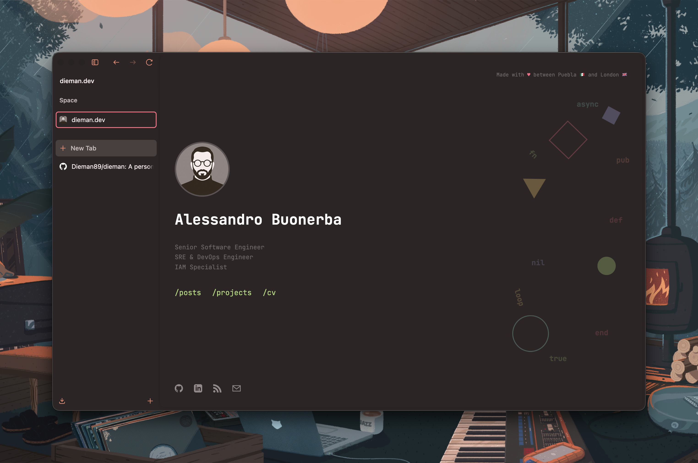

<p align="center">
  <a href="https://dieman.dev">
    
  </a>
  <br><br>
  <code>:posts |> Enum.concat(:cv) |> deploy_to_web()</code>
</p>

## Setup

```bash
mix deps.get
pre-commit install
```

## Development

```bash
mix start
```

Site available at <http://localhost:4999>

## Production Build

```bash
MIX_ENV=prod mix build
```

Output goes to `site/`. Deployment to GitHub Pages is automatic on push to `main`.

## Writing Posts

```bash
mix dieman.gen.post "My Post Title"
```

| Directory | Visibility |
|-----------|------------|
| `content/posts/` | Published (dev + prod) |
| `content/drafts/` | Draft (dev only) |

## Structure

```
lib/
├── dieman.ex      # Core utilities
├── data.ex        # Site content (name, links, taglines)
├── settings.ex    # Configuration (fonts, icons, date format)
├── components.ex  # Reusable UI components
├── layout.ex      # RootLayout + PostLayout
├── home.ex        # Home page
├── posts.ex       # Posts list
├── projects.ex    # Projects page
└── cv.ex          # CV page
static/
├── css/site.css   # Styles
├── js/glitch.js   # Glitch text effect
├── svg/           # Social icons (github, linkedin, rss, email)
└── images/        # Avatar and assets
```

## Code Quality

```bash
mix format   # Format code
mix lint     # Lint (credo --strict)
```
