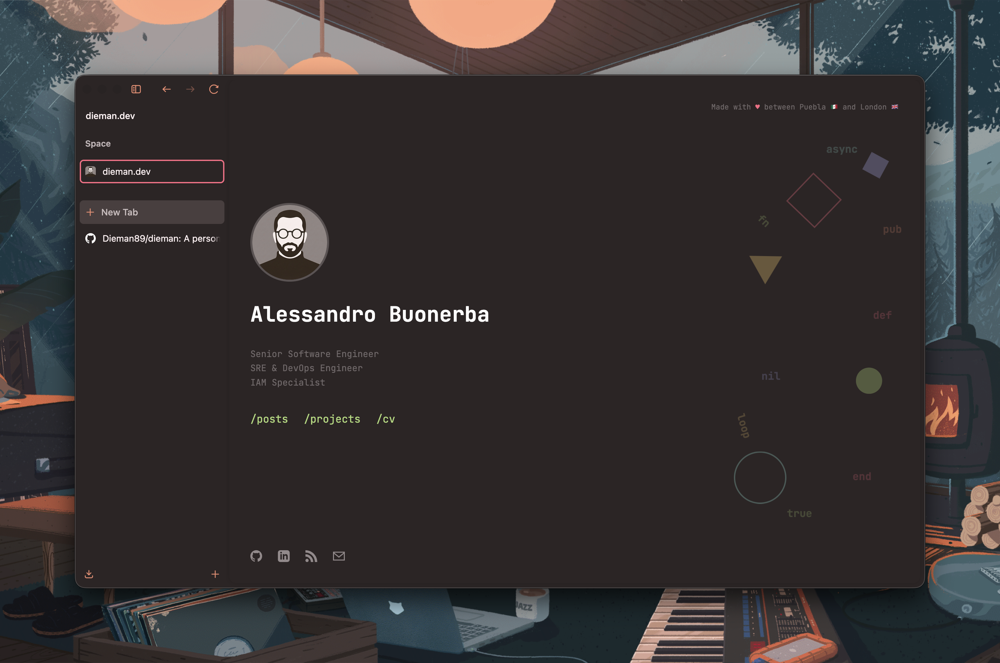

<p align="center">
  <a href="https://dieman.dev">
    
  </a>
  <br><br>
  <code>:posts |> Enum.concat(:cv) |> deploy_to_web()</code>
</p>

---

```bash
mix clean && mix compile          # clean and recompile
mix deps.get && mix start         # dev server at localhost:4999
mix build                         # build to site/ (CV auto-protected)
mix dieman.gen.post "Title"       # new post
cd worker && npx wrangler deploy  # deploy worker (hearts/views API)
```

CV is protected by Cloudflare Turnstile CAPTCHA + content-hashed URL.

## Worker

Rust Cloudflare Worker for post hearts/views API. Deployed automatically on push to `worker/`.

```bash
cd worker
npx wrangler dev              # local dev server at localhost:8787
npx wrangler deploy           # deploy to Cloudflare
```

Test locally:
```bash
curl localhost:8787/api/hearts/my-post         # get count
curl -X POST localhost:8787/api/hearts/my-post # increment
curl localhost:8787/api/views/my-post          # get views
curl -X POST localhost:8787/api/views/my-post  # increment views
```
