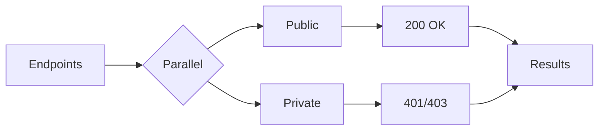

When building concurrent systems, the choice of language shapes not just your code, but your entire mental model. Go and Scala represent two fundamentally different philosophies: **velocity** versus **expressivity**.

I recently built the same tool in both languages, a parallel ::sc[HTTP] endpoint checker, and the experience revealed fascinating trade-offs worth exploring.

## The Task

Both implementations verify a list of web endpoints, checking whether paths are correctly configured as public or private. Simple enough, but the approaches couldn't be more different.



::divider[The Implementations]

## Go: Velocity Through Simplicity

The Go concurrency model is elegantly minimal. ::def[Goroutines]{Lightweight threads managed by Go's runtime, costing only ~2KB of stack space} are lightweight threads managed by the runtime, and launching one requires just the `go` keyword:

::tabs
```go[Config + Parallelism]
type Config struct {
    BaseURL     string
    PublicPath  []string
    PrivatePath []string
}

var wg sync.WaitGroup
wg.Add(len(config.PublicPath))

for _, path := range config.PublicPath {
    go func(p string) {
        defer wg.Done()
        checkEndpoint(p, true)
    }(path)
}

wg.Wait()
```

```go[HTTP Check]
func checkEndpoint(path string, expectPublic bool) {
    resp, err := http.Get(config.BaseURL + path)
    if err != nil {
        log.Printf("Error: %s", err)
        return
    }
    defer resp.Body.Close()

    if expectPublic && resp.StatusCode == 200 {
        log.Printf("✓ %s is public", path)
    } else if !expectPublic && resp.StatusCode == 401 {
        log.Printf("✓ %s is private", path)
    }
}
```
::

The ::def[sync.WaitGroup]{A synchronisation primitive that waits for a collection of goroutines to finish} coordinates completion: increment before launching, decrement when done, wait for zero. That's it.

::tip
What makes Go remarkable is what it *doesn't* require: no external dependencies, no complex type signatures, no build tool configuration. The standard library handles ::sc[HTTP], synchronisation, and everything else.
::

The Go runtime scheduler automatically distributes goroutines across ::sc[CPU] cores. You don't manage threads; you describe work. This abstraction lets developers focus on program structure rather than low-level threading.

## Scala: Expressivity Through Composition

Scala with ::def[Cats Effect]{A purely functional runtime system for Scala that provides safe, composable concurrency} takes a radically different approach. Instead of imperative coordination, you compose effects:

::tabs
```scala[HTTP Check]
def checkStatusCode(client: Client[IO], url: String): IO[Status] =
  IO.fromEither(Uri.fromString(url))
    .flatMap(uri => client.run(Request[IO](GET, uri = uri))
      .use(resp => IO.pure(resp.status)))
    .handleError(_ => Status.ServiceUnavailable)

def isPublic(config: Config, path: String)
            (client: Client[IO]): IO[Endpoint] =
  checkStatusCode(client, config.baseUrl + path).map { status =>
    if (status == Status.Ok)
      Endpoint.CheckSuccess(path, status.code)
    else
      Endpoint.CheckError(path, status.code, expected = 200)
  }
```

```scala[Parallel Composition]
val privatePathValidation = config.privatePath
  .parTraverse(path => isPrivate(config, path)(client))

val publicPathValidation = config.publicPath
  .parTraverse(path => isPublic(config, path)(client))

(privatePathValidation, publicPathValidation)
  .parMapN(_ ++ _)
```
::

The ::def[parTraverse]{Applies an effectful operation to each element in parallel, collecting results} function applies an effectful operation to each element in parallel, while ::def[parMapN]{Combines results from independent parallel computations into a single value} combines results from independent parallel computations. Error handling, resource management, and cancellation are all handled by the type system.

::divider[The Numbers]

## Performance Comparison

Running both on ::sc[CI] revealed the velocity gap:

::grid
::stat[5s]{Go Build + Run|green}
::stat[51s]{Scala Build + Run|red}
::stat[10x]{Speed Difference|yellow}
::

::compare
| Implementation | Dependencies | Build + Run Time |
|----------------|--------------|------------------|
| Go             | 0 external   | 5 seconds        |
| Scala          | 12 libraries | 51 seconds       |
| Scala (cached) | 12 libraries | 39 seconds       |
::

::note
Go is **10x faster**. Zero dependencies means no download time, no resolution, no compilation of external libraries. It just builds and runs.
::

::divider[When to Choose]

## When Each Wins

**Go excels** when you need fast iteration cycles and deployment simplicity. It's perfect for ::sc[CLI] tools, microservices, and DevOps tooling where a single binary matters. Teams with mixed experience levels can be productive quickly thanks to Go's deliberately simple design.

**Scala shines** in complex distributed systems where type safety prevents entire categories of bugs. When you need sophisticated error handling, resource management, and your domain benefits from functional composition, Scala's expressivity pays dividends. It's also the natural choice for Big Data workloads with Spark or Flink, or when you need deep ::sc[JVM] ecosystem access.

## The Trade-off

| Aspect | Go | Scala |
|--------|-----|-------|
| Learning curve | ::badge[Weekend]{green} | ::badge[Months]{red} |
| Feedback loop | ::badge[Fast]{green} | ::badge[Slow]{red} |
| Type safety | ::badge[Basic]{red} | ::badge[Advanced]{green} |
| Abstraction | ::badge[Limited]{red} | ::badge[Powerful]{green} |
| Deployment | ::badge[Single binary]{green} | ::badge[JVM + deps]{red} |
| Ecosystem | ::badge[Standard lib]{yellow} | ::badge[Rich libraries]{green} |

::divider[Conclusion]

Neither is universally better. Go wins on **velocity**; Scala wins on **expressivity**. The right choice depends on what you're building, who's building it, and how long you'll maintain it.

For a quick endpoint checker? Go, every time. For a distributed event processing pipeline? Scala's type safety becomes invaluable.

::quote[The Pragmatic Engineer]
The best engineers know both philosophies and reach for the right tool.
::
