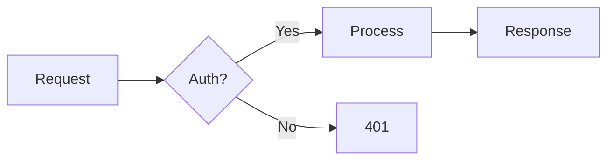
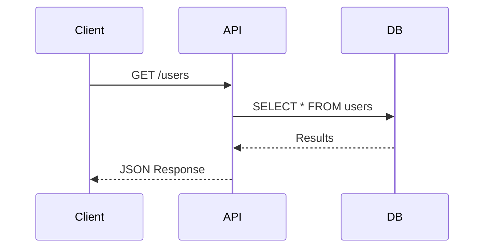

This post tests all the custom markdown components available in this blog :fire:.

## Keyboard Shortcuts

You can display keyboard shortcuts inline. Press [[Cmd+K]] to open search,
or use [[Ctrl+Shift+P]] for the command palette.

Common shortcuts:

- Copy: [[Cmd+C]]
- Paste: [[Cmd+V]]
- Save: [[Cmd+S]]
- Undo: [[Cmd+Z]]

## YouTube Embeds

Embed YouTube videos with a simple shortcode. Use `[center]` for smaller or `[full]` for full width:

::youtube[center]{dQw4w9WgXcQ}
::youtube[full]{dQw4w9WgXcQ}

## Images with Captions

Display images with proper figure/figcaption markup:

::figure{/images/avatar.png|Profile avatar|My profile picture used across the site}

You can also use it without a caption:

::figure{/images/avatar.png|Just an avatar}

### Alignment Options

Control image alignment with `[left]`, `[center]`, or `[full]`:

::figure[left]{/images/avatar.png|Left aligned|This image is left-aligned}

::figure[center]{/images/avatar.png|Centered|This image is centered (default)}

::figure[full]{/images/projects/zen-monokai-ristretto.png|Full width|This image takes full container width}

### Image Grid

Display multiple images side-by-side with `::grid`. Use `::grid[60%]` to set width, and wrap with `::center` to center:

::center
::grid[60%]
::figure{/images/avatar.png|First image}
::figure{/images/site.png|Second image}
::
::

## Code Block

```go
type Config struct {
    BaseURL     string
    PublicPath  []string
    PrivatePath []string
}

var wg sync.WaitGroup
wg.Add(len(config.PublicPath))

for _, path := range config.PublicPath {
    go func(p string) {
        defer wg.Done()
        checkEndpoint(p, true)
    }(path)
}

wg.Wait()
```

:smile:

## Code Tabs

Show the same example in multiple languages with a tabbed interface:

::tabs
```go[Go]
func hello() {
    fmt.Println("Hello, World!")
}
```

```scala[Scala]
def hello(): Unit = {
    println("Hello, World!")
}
```

```elixir[Elixir]
def hello do
  IO.puts("Hello, World!")
end
```
::

## File Trees

Display directory structures with syntax highlighting:

::tree[React App]
my-project/
  src/
    components/
      Button.tsx
      Input.tsx
      Modal.tsx
    pages/
      index.tsx
      about.tsx
    styles/
      global.css
  config/
    settings.json
  package.json
  README.md
::

Another example with an Elixir project:

::tree[Elixir Project]
lib/
  my_app/
    router.ex
    endpoint.ex
  my_app.ex
mix.exs
config/
  config.exs
  dev.exs
  prod.exs
::

## Comparison Tables

Display tables with winner highlighting for comparisons:

::compare

| Framework | Build Time |
|-----------|------------|
| Vite      | 0.5s       |
| Webpack   | 3.2s       |
| Parcel    | 2.1s       |

::

The first data row is automatically highlighted as the "winner" with green styling.

## Callout Boxes

Display notes, warnings, and tips:

::note
This is a note with important information that readers should be aware of.
::

::warning
Be careful with this approach as it may have unintended side effects.
::

::tip
Pro tip: use this pattern for better performance in production.
::

## Collapsible Sections

Hide content that can be expanded on click:

::details[Show implementation details]
This content is hidden by default. You can put code examples, lengthy explanations, or optional information here.

It supports **markdown** formatting inside too, including badges: ::badge[Elixir]{purple} ::badge[OTP 26]{blue}
::

## Terminal Output

Display command-line interactions:

::terminal
$ mix compile
{green:Compiling 5 files (.ex)}
{yellow:warning: variable "foo" is unused}
{red:** (CompileError) undefined function bar/0}
{#ff8800:Custom orange with hex}
{cyan:Info: Build completed}
::

## Quotes with Attribution

::quote[Rich Hickey]
Simple made easy.
::

::quote[Alan Kay]
The best way to predict the future is to invent it.
::

## Diff Blocks

Show code changes with additions and removals:

::diff
- def hello(name) do
-   IO.puts("Hello #{name}")
- end
+ def hello(name, greeting \\ "Hello") do
+   IO.puts("#{greeting}, #{name}!")
+   :ok
+ end
::

## Badges

Inline labels for versions and status: ::badge[v2.0.0]{green} ::badge[deprecated]{red} ::badge[beta]{yellow} ::badge[new]{blue}

You can also use plain badges: ::badge[MIT License] ::badge[TypeScript]

## Tooltips

Inline hover definitions for technical terms: Working with ::def[IAM]{Identity and Access Management} policies in ::def[K8s]{Kubernetes container orchestration} clusters requires understanding ::def[RBAC]{Role-Based Access Control}.

## Mermaid Diagrams

Flowcharts and diagrams rendered inline:



Sequence diagrams:



## GitHub Gist

Embed GitHub Gists with syntax highlighting:

::gist{Dieman89/7d224f6a27ac222ada1af07b607d5c6f}

## Stats Cards

Display metrics with prominent values. Use `::grid` for full-width grid:

::grid
::stat[99.9%]{Uptime}
::stat[1.2M]{Downloads}
::stat[<50ms]{Response Time}
::stat[24/7]{Support}
::

Or use inline for individual stats: ::stat[42]{Answer}

## Link Cards

Rich link previews for external resources. Use `::grid` for side-by-side:

::grid
::link{https://github.com/elixir-lang/elixir|Elixir Programming Language}
::link{https://hexdocs.pm/phoenix/overview.html|Phoenix Framework Docs}
::

## Image Comparison

Drag to compare before and after images:

::compare-images{/images/projects/systems.png|/images/projects/zen-monokai-ristretto.png|Before|After}

## Steps

Display step-by-step instructions with numbered indicators:

::steps
Download the installer from the [official website](https://elixir-lang.org) ::badge[Required]{green}
Run the installer and follow the prompts ::badge[5 min]{blue}
Restart your computer when complete ::badge[Optional]{yellow}
Verify installation by running `elixir --version` ::badge[Terminal]{purple}
::

## Timeline

Display chronological events with a vertical timeline:

::timeline
2024 | Senior Engineer | Joined the platform team ::badge[Elixir]{purple} ::badge[K8s]{blue}
2023 | Software Engineer | Built the real-time notification system ::badge[Phoenix]{green}
2022 | Junior Engineer | Started career ::badge[Elixir]{purple} ::badge[PostgreSQL]{blue}
2021 | Intern | First exposure to functional programming
::

## Combining Components

You can use these alongside regular markdown:

> **Pro tip:** Use [[Cmd+Shift+F]] to search across all files in your project.

::tip
Install dependencies with [[Cmd+Shift+P]] and select "Install". Requires ::badge[Node 18+]{green} or ::badge[Bun]{yellow}.
::

::note
This feature is ::badge[beta]{yellow} and requires ::badge[v2.0.0]{green}. Press [[Cmd+K]] to enable experimental mode.
::

::details[Version compatibility]
Supported runtimes: ::badge[Node 18+]{green} ::badge[Deno]{blue} ::badge[Bun]{yellow}

Use [[Cmd+Shift+V]] to check your current version.
::

## Dividers

Horizontal rules with centered text:

::divider[Section Break]

Some content between dividers.

::divider[Next Chapter]

## Highlights

Mark ::mark[important text] in your content. You can also use colors:

- ::mark[Default yellow]{yellow} highlight
- ::mark[Orange]{orange} for warnings
- ::mark[Green]{green} for success
- ::mark[Blue]{blue} for info
- ::mark[Purple]{purple} for special
- ::mark[Red]{red} for critical

## Small Caps

Use small caps for abbreviations like ::sc[HTML], ::sc[CSS], and ::sc[API]. They work great for acronyms like ::sc[REST] or ::sc[GraphQL].

## Tweet Embed

Video tweet:
::tweet{https://x.com/Dieman_/status/1633352831511023616}

Text only tweet:
::tweet{https://x.com/Dieman_/status/1534779818339885058}

Image tweet:
::tweet{https://x.com/Dieman_/status/1474516364434022402}
